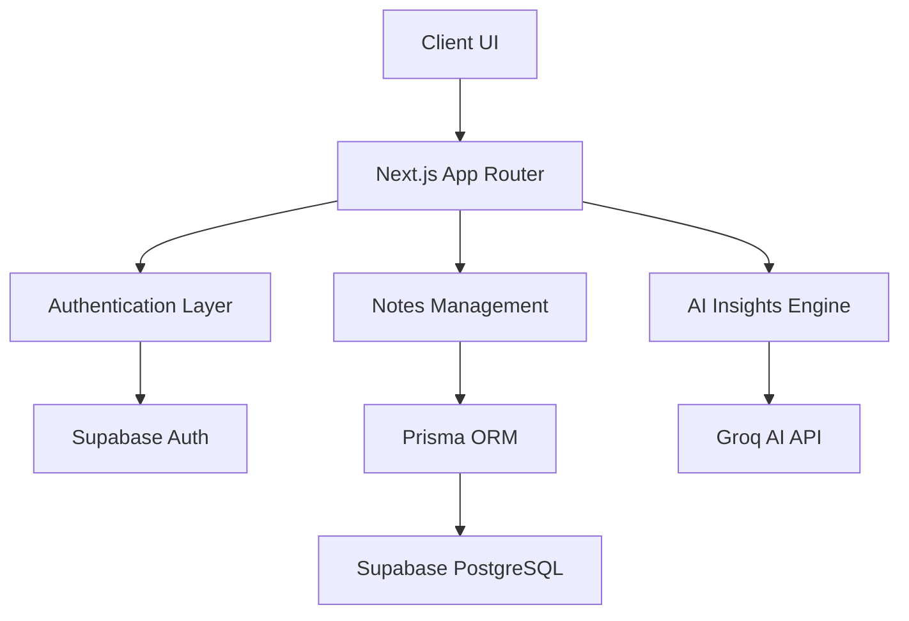

# Peblo Notes AI

Peblo Notes AI is a modern AI-powered productivity and note-taking platform built with Next.js, Supabase, Prisma, and Groq AI.

The project focuses on creating a clean, distraction-free workspace where users can write notes, organize ideas, and generate AI-powered insights in a premium dark-themed interface inspired by modern productivity tools.

---

# Features

- Secure authentication using Supabase Auth
- Create, edit, archive, and manage notes
- AI-generated summaries and insights
- AI action item generation
- Autosave editing workflow
- Public note sharing with shareable links
- Tagging and note organization
- Responsive dashboard experience
- Modern premium dark UI
- Mobile-responsive layout
- Smooth animations with Framer Motion
- Real-time PostgreSQL database integration

---

# Tech Stack

## Frontend
- Next.js 16 (App Router)
- React
- Tailwind CSS
- Framer Motion
- Lucide React

## Backend
- Next.js API Routes
- Prisma ORM
- Supabase PostgreSQL

## Authentication
- Supabase Auth

## AI Integration
- Groq API

---

# Architecture



---

# Project Structure

```bash
src/
├── actions/
├── app/
│   ├── api/
│   ├── auth/
│   ├── dashboard/
│   ├── notes/
│   └── share/
├── components/
│   ├── ai/
│   ├── dashboard/
│   ├── notes/
│   └── ui/
├── hooks/
├── lib/
├── providers/
└── styles/
```

---

# Environment Variables

Create a `.env` file in the root directory:

```env
DATABASE_URL=
DIRECT_URL=

NEXT_PUBLIC_SUPABASE_URL=
NEXT_PUBLIC_SUPABASE_ANON_KEY=

GROQ_API_KEY=
```

---

# Installation

Clone the repository:

```bash
git clone https://github.com/sukanya-2006/Peblo-Notes-AI.git
```

Install dependencies:

```bash
npm install
```

Run Prisma database sync:

```bash
npx prisma db push
```

Start the development server:

```bash
npm run dev
```

---

# UI & Design Improvements

The UI was redesigned with a focus on creating a more premium and focused productivity experience.

Recent improvements include:

- Redesigned modern landing page
- Fixed responsive navigation
- Improved mobile responsiveness
- Premium black-and-white visual system
- Cleaner typography hierarchy using Inter
- Refined dashboard spacing and layout
- Improved AI insights interface
- Better note readability and editor spacing
- Enhanced hover states and visual feedback
- Smoother scrolling and animations
- More consistent component styling

The design direction is inspired by modern productivity products such as Notion, Linear, and Craft while maintaining a distinct Peblo Notes identity.

---

# Current Capabilities

- AI-generated note summaries
- AI action item extraction
- Responsive dashboard
- Authentication system
- Shareable note routes
- Autosave note editing
- Note tagging system
- Dynamic note organization

---

# Deployment

The project is optimized for deployment on:

- Vercel
- Supabase
- Prisma PostgreSQL workflows

---

# Future Vision

Peblo Notes AI is being designed as more than a basic notes app.

The long-term vision is to build an intelligent productivity workspace capable of:

- contextual AI assistance
- smart note relationships
- collaborative workflows
- productivity analytics
- semantic search
- workspace organization
- AI-powered planning systems

Additional planned improvements are documented in:

```bash
FUTURE_IMPROVEMENTS.md
```

---

# Author

## Sukanya Bhowmick

GitHub:
https://github.com/sukanya-2006

---

# License

This project is built for educational, portfolio, and internship evaluation purposes.